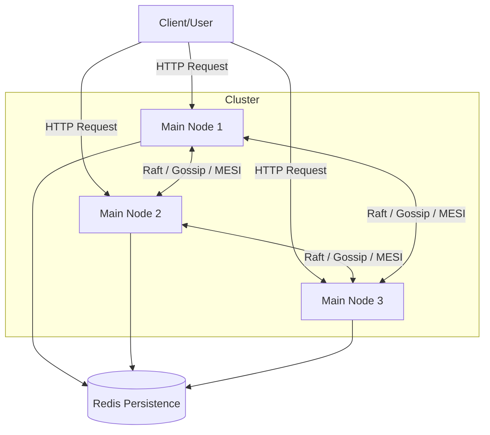
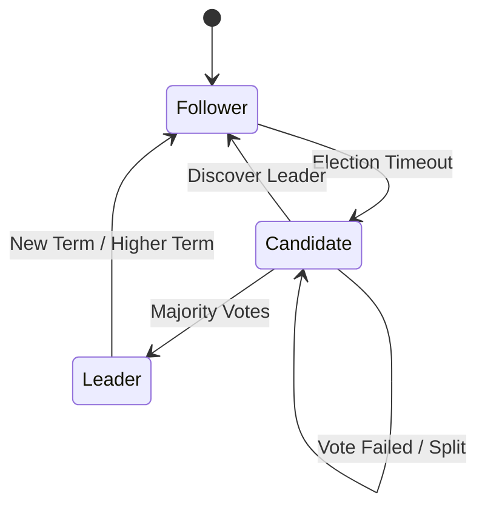
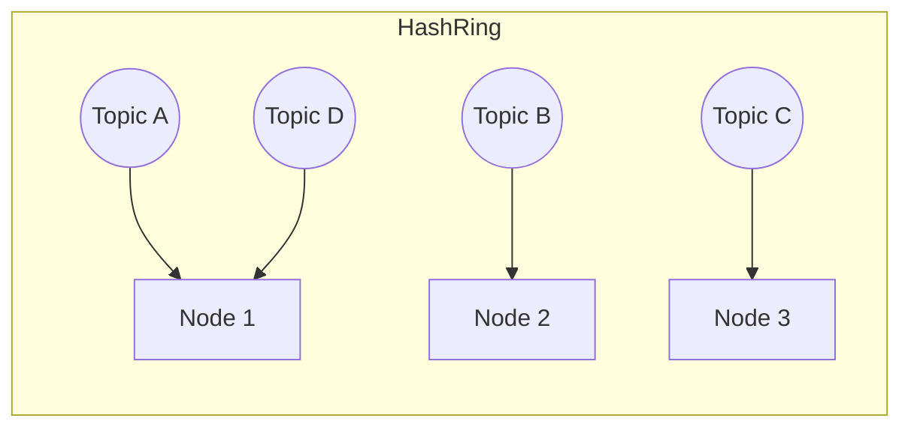
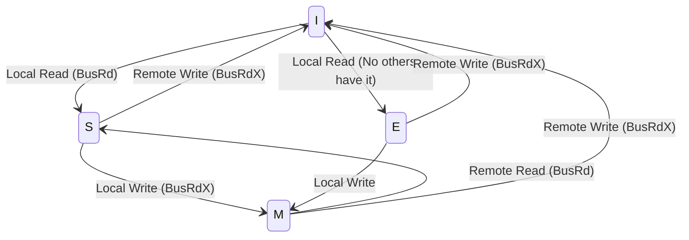

# Distributed Synchronization System Architecture

## 1. System Overview
Sistem ini adalah platform sinkronisasi terdistribusi yang menyediakan tiga layanan utama: Distributed Locking, Distributed Queuing, dan Distributed Caching. Sistem dibangun menggunakan arsitektur peer-to-peer di mana setiap node (3 node) memiliki kapabilitas yang sama.

## 2. Core Components

### A. Distributed Lock Manager (Raft Consensus)
Menggunakan algoritma Raft untuk memastikan konsistensi dalam pengelolaan lock.
- **Leader Election**: Node berkompetisi untuk menjadi Leader melalui mekanisme voting jika tidak menerima heartbeat.
- **Lock Management**: Hanya Leader yang berhak memberikan `acquire` atau `release` lock.

### B. Distributed Queue System (Consistent Hashing)
Menggunakan Consistent Hashing untuk mendistribusikan beban penyimpanan antrean.
- **Consistent Hashing**: Memetakan setiap `topic` ke node tertentu pada *hash ring*.
- **Persistence**: Setiap pesan disimpan di Redis.

### C. Distributed Cache Coherence (MESI Protocol)
Memastikan integritas data cache di seluruh node menggunakan protokol MESI.

## 3. Communication Pattern
- **Inter-node communication**: Menggunakan HTTP REST API (asynchronous via `aiohttp`).
- **State Management**: Redis digunakan untuk persistensi data antrean.

## 4. Technology Stack
- **Language**: Python 3.9+ (Asyncio)
- **Web Framework**: aiohttp
- **State Store**: Redis
- **Containerization**: Docker & Docker Compose
