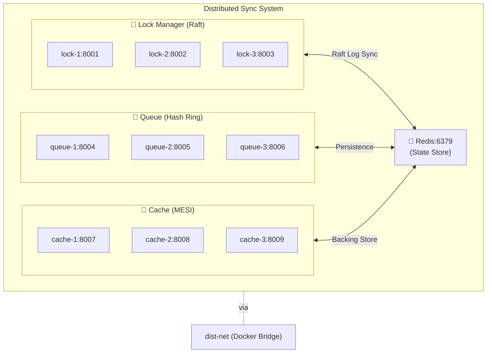
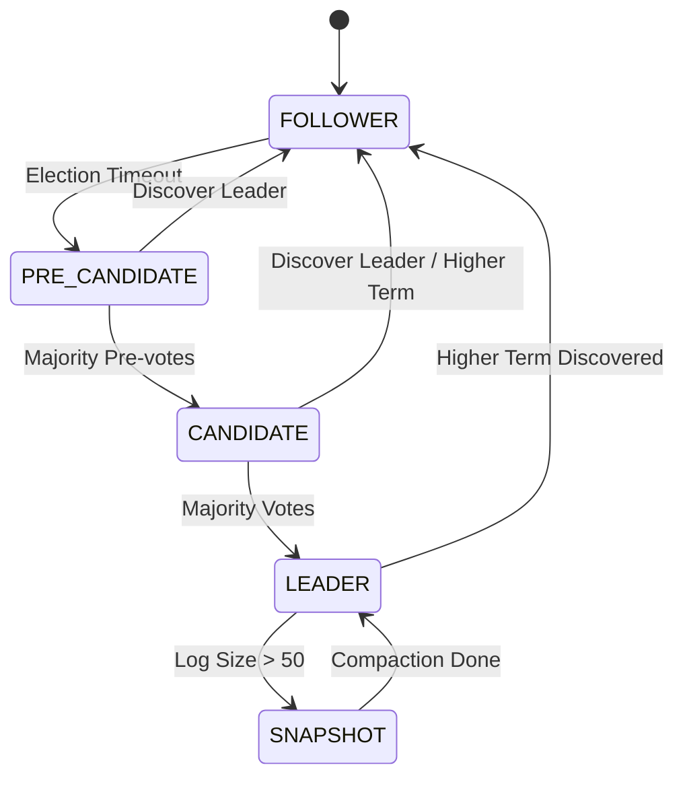
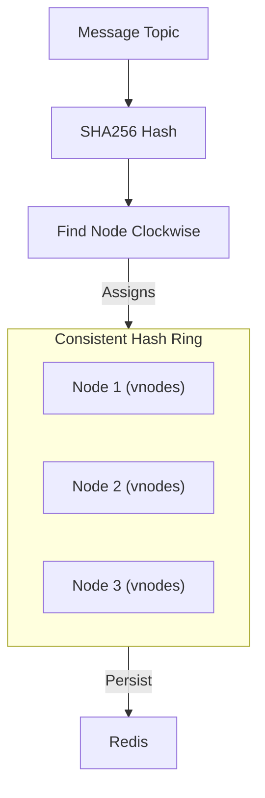
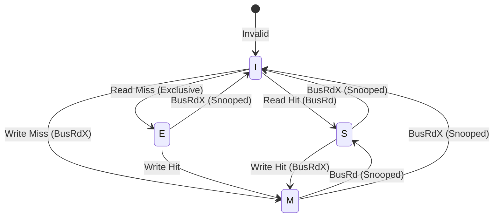
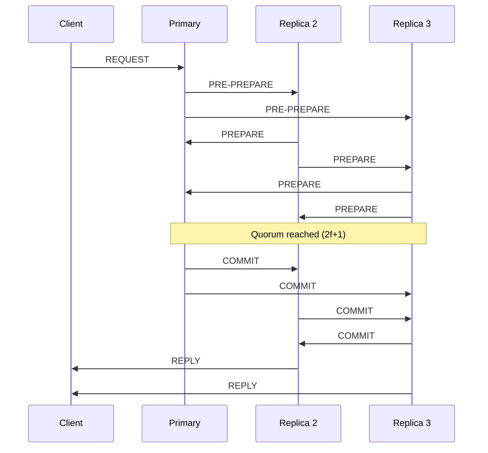
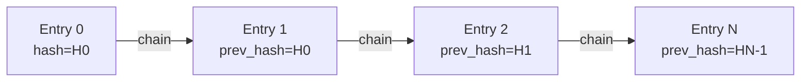

# Distributed Synchronization System Architecture

## 1. System Overview
Sistem ini adalah platform sinkronisasi terdistribusi tingkat lanjut yang mencakup layanan **Distributed Locking**, **Distributed Queuing**, dan **Distributed Caching**. Berbeda dengan arsitektur monolitik, sistem ini menggunakan **10-Node Cluster** yang terspesialisasi untuk menjamin ketersediaan tinggi (High Availability), toleransi kesalahan (Fault Tolerance), dan keamanan data.

### System Topology (10-Node Cluster)

---

## 2. Core Components & Protocols

### A. Distributed Lock Manager (Hardened Raft Consensus)
Komponen ini menjamin bahwa resource hanya bisa diakses oleh satu klien pada satu waktu.
- **Protokol:** Raft Consensus.
- **Optimasi Lanjut:**
    - **Pre-vote Phase:** Mencegah gangguan kluster dari node yang baru bangkit.
    - **Log Compaction (Snapshots):** Snapshotting otomatis setiap 50 entri.

### B. Distributed Queue System (Consistent Hashing & Redis)
Sistem antrean pesan yang terdistribusi secara merata.
- **Sharding:** Menggunakan **Consistent Hashing** untuk memetakan topik pesan.
- **Persistence:** Pesan disimpan di **Redis 7**.

### C. Distributed Cache Coherence (MESI Protocol)
Manajemen cache lokal yang tetap sinkron menggunakan protokol MESI.

### D. Practical Byzantine Fault Tolerance (PBFT)
Menangani node yang berperilaku aneh atau jahat (Byzantine).

---

## 3. Security & Observability

### A. Role-Based Access Control (RBAC)
- **Admin:** Akses penuh.
- **Producer/Consumer:** Akses terbatas ke antrean.
- **Reader:** Akses read-only ke cache.

### B. Audit Logging (Tamper-Proof Logic)
Setiap transaksi krusial dicatat secara permanen untuk verifikasi keamanan.

### C. Health Monitoring & Self-Healing
Setiap container dilengkapi dengan **Docker Healthchecks** yang memantau endpoint `/health` dan melakukan restart otomatis jika terdeteksi kegagalan.

---

## 4. Technology Stack
- **Language:** Python 3.11 (Asyncio)
- **Communication:** HTTP/REST (aiohttp)
- **Persistence:** Redis 7
- **Infrastructure:** Docker & Docker Compose (10 Containers)
