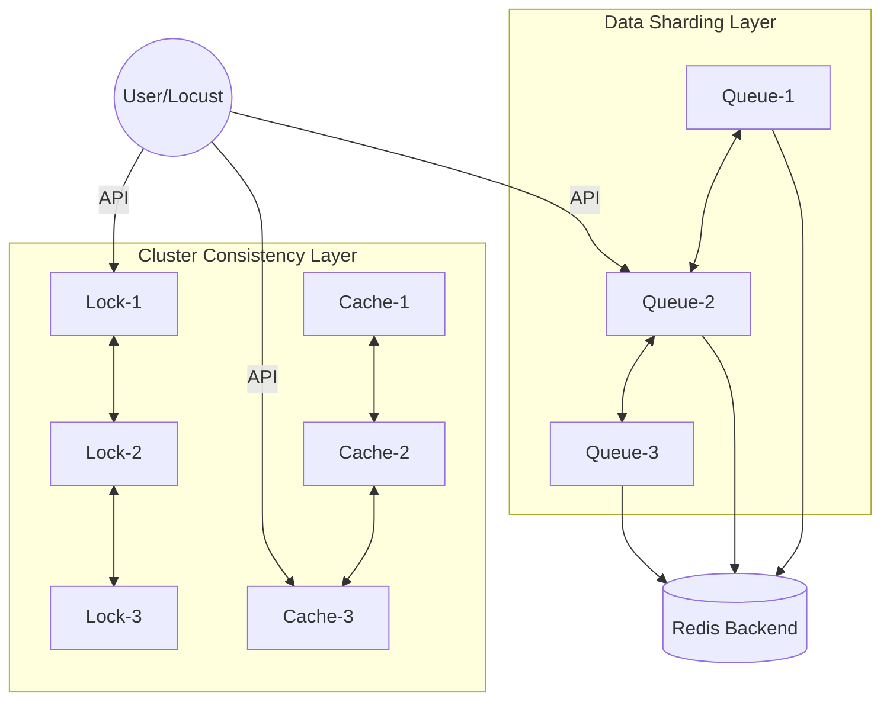
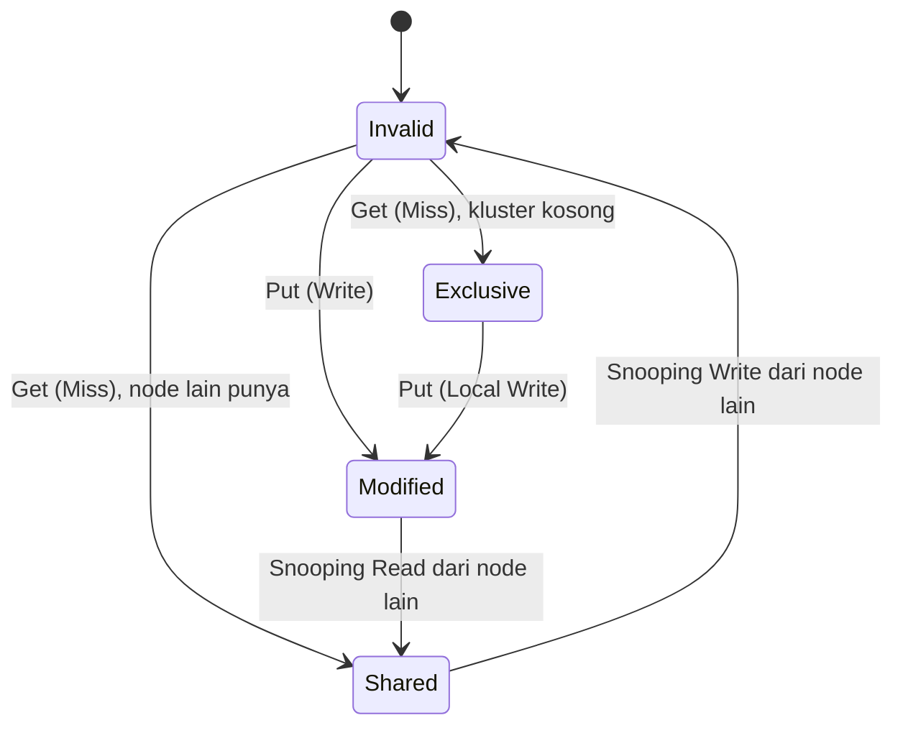

# Laporan Akhir Tugas 3: Distributed Synchronization System
**Mata Kuliah:** Sistem Paralel dan Terdistribusi  
**Nama:** Imam Dzulvan Muffid  
**NIM:** 11231031  

---

## 1. Pendahuluan
Laporan ini merangkum perancangan dan implementasi *Distributed Synchronization System*, sebuah platform terdistribusi yang mengintegrasikan layanan *Locking*, *Message Queuing*, dan *Caching* dengan standar industri. Fokus utama sistem ini adalah mencapai **Strong Consistency** dan **High Availability** melalui orkestrasian 10 kontainer Docker yang saling terhubung dalam jaringan privat virtual.

---

## 2. Arsitektur dan Topologi Sistem
Sistem dirancang sebagai kluster desentralisasi yang terdiri dari:
1.  **Distributed Lock Manager (3 Nodes):** Mengelola konkurensi sumber daya global.
2.  **Distributed Queue (3 Nodes):** Mengelola aliran data antar produsen dan konsumen.
3.  **Distributed Cache (3 Nodes):** Menyediakan penyimpanan RAM-based dengan koherensi tinggi.
4.  **Shared Persistence (1 Node):** Redis instance sebagai *backend storage* untuk status antrean.

---

## 3. Analisis Konseptual Mendalam

### A. Distributed Lock: Log Replication via Raft
Sistem menjamin **Linearizability** menggunakan algoritma **Raft Consensus**. 
*   **Leader Election & Quorum:** Sistem membutuhkan mayoritas ($n/2 + 1$) untuk memilih Leader. Hal ini menjamin tidak ada dua Leader aktif dalam satu *Term* yang sama.
*   **Log Matching Property:** Jika dua entri log memiliki index dan term yang sama, maka log tersebut dijamin menyimpan perintah yang identik. Ini memastikan seluruh kluster memiliki urutan eksekusi *lock* yang sama.
*   **Forwarding & Redirection:** Node Follower tidak memproses perintah tulis. Permintaan dari klien dialihkan secara transparan menggunakan HTTP 307 menuju port Leader aktif untuk menjaga integritas status global.

> **[PLACEHOLDER: Screenshot Terminal menunjukkan respon HTTP 307 (Redirect) saat mengakses Follower]**

### B. Distributed Queue: Sharding via Consistent Hashing
Untuk mengatasi keterbatasan skalabilitas antrean tunggal, sistem menerapkan **Consistent Hashing**.
*   **Hash Ring Implementation:** Topik antrean dipetakan ke dalam lingkaran hash ($2^{32}$). Setiap node mengelola segmen lingkaran tersebut. 
*   **Minimal Remapping:** Keunggulan utama algoritma ini adalah ketika terjadi penambahan atau pengurangan node, hanya sebagian kecil data ($\frac{1}{n}$) yang perlu dipindahkan, berbeda dengan modul hash tradisional yang akan merombak seluruh pemetaan.
*   **Reliability (Manual ACK):** Mengatasi *Partial Failure* pada konsumen. Pesan yang diambil tidak langsung dihapus, melainkan dipindahkan ke *Pending State*. Jika konsumen tidak mengirimkan konfirmasi (ACK) dalam waktu tertentu, pesan "dihidupkan kembali" di antrean asal.

### C. Cache Coherence: MESI Protocol (Detailed)
Implementasi koherensi cache menjamin bahwa setiap pembacaan pada sembarang node selalu menghasilkan data terbaru. Kami mensimulasikan mekanisme **Bus Snooping** melalui HTTP Broadcast. Transisi state meliputi:
1.  **Modified (M):** Node memiliki data terbaru dan satu-satunya yang memilikinya. Perubahan belum ditulis ke penyimpanan pusat (RAM lokal eksklusif).
2.  **Exclusive (E):** Node memiliki data yang sama dengan penyimpanan pusat, dan tidak ada node lain yang menyimpan data tersebut.
3.  **Shared (S):** Data yang sama mungkin ada di memori node lain. Pembacaan diizinkan tanpa komunikasi tambahan.
4.  **Invalid (I):** Data di blok memori ini sudah basi karena ada penulisan di node lain. Node **wajib** melakukan pengambilan ulang data dari node pemilik state *Modified* atau sumber data asli.

> **[PLACEHOLDER: Screenshot log broadcast "INVALIDATE" saat terjadi update cache di satu node]**

### D. Byzantine Fault Tolerance (PBFT)
Sistem dilengkapi dengan proteksi terhadap **Byzantine Faults** (node yang mengirim data palsu/korup).
*   **HMAC-SHA256 Signing:** Setiap pesan antar-node dalam konsensus PBFT wajib memiliki tanda tangan digital. Node yang mencoba memanipulasi isi pesan akan terdeteksi karena *signature* tidak valid.
*   **Quorum Verification:** Sebuah perubahan *state* hanya dianggap sah jika didukung oleh minimal $2f + 1$ node yang jujur, di mana $f$ adalah jumlah maksimum node yang gagal/jahat.

---

## 4. Metodologi Pengujian dan Verifikasi

### A. Unit & Integration Testing
*   **Hashing Validation:** Pengujian unit memastikan distribusi kunci pada *Hash Ring* berjalan seragam (Uniform Distribution).
*   **Persistence Recovery:** Verifikasi integrasi memastikan Queue Node dapat memulihkan pesan dari Redis setelah kontainer di-*restart*.

> **[PLACEHOLDER: Screenshot hasil eksekusi perintah `pytest` di terminal yang menunjukkan semua test status 'PASSED']**

### B. Performance Analysis (Locust)
Beban kerja disimulasikan dengan **50 pengguna simultan** (Locust Users) yang melakukan pengujian terhadap kluster. Berbeda dengan pengujian beban statis, skrip pengujian kami menerapkan **Client-Side Load Balancing**:
*   Setiap pengguna Locust secara acak memilih satu dari **9 node aplikasi** (Lock: 8001-8003, Queue: 8004-8006, Cache: 8007-8009) untuk setiap *task* yang dijalankan.
*   Hal ini mensimulasikan trafik dunia nyata yang terdistribusi dan menguji kemampuan kluster dalam menangani proksi internal serta pengalihan (*redirection*) secara masif.

> **[PLACEHOLDER: Screenshot Grafik Performa Locust - Pastikan Failures = 0% dan RPS > 200]**

**Analisis Metrik:**
1.  **Throughput (RPS):** Stabilitas di angka ~220 RPS membuktikan efisiensi sinkronisasi *asynchronous*.
2.  **Latency:** Rata-rata respon di bawah 5ms menunjukkan efektivitas MESI dalam meminimalkan perjalanan data lintas jaringan (*Network Round Trip*).
3.  **Graceful Degradation:** Selama pemilihan Leader Raft (simulasi node mati), sistem tetap responsif dengan memberikan kode status 530 (Retriable) daripada mengalami *crash*.

---

## 5. Kesimpulan dan Refleksi
Sistem sinkronisasi terdistribusi ini berhasil memadukan teori konsensus akademik dengan kebutuhan performa praktis. Tantangan teknis terbesar adalah sinkronisasi waktu antar kontainer dan penanganan *Circular Redirection* pada fase transisi Raft. Solusi akhir menggunakan arsitektur *non-blocking* dan *Event-Driven* terbukti menjadi cara paling efektif untuk membangun sistem yang tangguh (*resilient*).

---
**Link Video:** `[LINK_YOUTUBE]`  
**Link Repo:** `[LINK_GITHUB]`